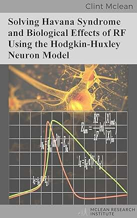

# Solving Havana Syndrome and Biological Effects of RF Using the Hodgkin-Huxley Neuron Model

**Clint McLean**

**[McLean Research Institute](https://www.mcleanresearchinstitute.com)**

---

## Copyright

Copyright © 2022 Clint McLean

Published by [McLean Research Institute](https://www.mcleanresearchinstitute.com)

All rights reserved. No portion of this book may be reproduced in any form without permission from the publisher, except as permitted by U.S. copyright law. For permissions contact: [clint@mcleanresearchinstitute.com](mailto:clint@mcleanresearchinstitute.com)

**ISBN:** 978-0-6397-2006-7 (ebook)

Although the author has made every effort to ensure that the information in this book was correct at press time, the author and publisher does not assume and hereby disclaims any liability to any party for any loss, damage, or disruption caused by errors or omissions, whether such errors or omissions result from negligence, accident, or any other cause.

This book is not intended as a substitute for the medical advice of physicians. The reader should consult a physician in matters relating to his/her health and particularly with respect to any symptoms that may require diagnosis or medical attention.

The information described here is intended as evidence for the biological effects of electromagnetic radio and microwave frequencies. It is not intended to be a source of legal advice in itself. You should consult with a lawyer for further details on how to use this information.

---

## Table of Contents {#toc}

1. [Introduction](#1-introduction)
2. [Background](#2-background)
3. [Methods](#3-methods)
   - [3.1 Temperature Sensitive Neuron Model](#31-temperature-sensitive-neuron-model)
   - [3.2 Temperature Sensitive Neural Network](#32-temperature-sensitive-neural-network)
   - [3.3 Artificial Life Food Finding Task](#33-artificial-life-food-finding-task)
4. [Results](#4-results)
   - [4.1 Effect on Equilibrium and Membrane Voltages](#41-effect-on-equilibrium-and-membrane-voltages)
   - [4.2 Temperature Induced Signaling Effects](#42-temperature-induced-signaling-effects)
   - [4.3 Further From Threshold Inhibition](#43-further-from-threshold-inhibition)
   - [4.4 Shorter, Thinner Action Potential Inhibition](#44-shorter-thinner-action-potential-inhibition)
   - [4.5 Increased Spike Rate Frequency Excitation](#45-increased-spike-rate-frequency-excitation)
   - [4.6 Temperature Pulse Induced Anode Break Excitation](#46-temperature-pulse-induced-anode-break-excitation)
   - [4.7 Neural Network Amplification of RF Effects on Signaling](#47-neural-network-amplification-of-rf-effects-on-signaling)
   - [4.8 Results of the Artificial Life Food Finding Task](#48-results-of-the-artificial-life-food-finding-task)
5. [Discussion](#5-discussion)
6. [Conclusion](#6-conclusion)
7. [Acknowledgments](#acknowledgments)
8. [Supplementary Materials](#supplementary-materials)
9. [Bibliography](#bibliography)

---

## List of Figures {#figures}

- [Figure 1](#figure-1) — Thermoelastic pressure effects on ionic current through channels
- [Figure 2](#figure-2) — Closed sodium channels produce 0 mV membrane voltage
- [Figure 3](#figure-3) — Open sodium channels resulting in membrane voltage
- [Figure 4](#figure-4) — Closed potassium channels produce 0 mV membrane voltage
- [Figure 5](#figure-5) — Open potassium channels resulting in membrane voltage
- [Figure 6](#figure-6) — Method to determine degree of excitatory or inhibitory effect
- [Figure 7](#figure-7) — Graphical representation of the neural network's agent and environment
- [Figure 8](#figure-8) — Graphical representation of the agent's neural network
- [Figure 9](#figure-9) — Graphical representation of the neurons' membrane voltages
- [Figure 10](#figure-10) — Equilibrium Voltages at 6.3°C and 16.3°C
- [Figure 11](#figure-11) — Subthreshold fluctuations at different temperatures
- [Figure 12](#figure-12) — Threshold stimulus inhibition effect
- [Figure 13](#figure-13) — Delayed activation at higher temperature
- [Figure 14](#figure-14) — Pre-synaptic action potential spike effects
- [Figure 15](#figure-15) — Increased spike rate frequency excitation
- [Figure 16](#figure-16) — Excitatory effect of RF pulse induced temperature increase
- [Figure 17](#figure-17) — Excitatory and inhibitory effects from RF pulse timing
- [Figure 18](#figure-18) — Neurological signaling effects in neural networks
- [Figure 19](#figure-19) — Average percentage of neurons in error from neural noise
- [Figure 20](#figure-20) — Average percentage of neurons in error from temperature increases
- [Figure 21](#figure-21) — Average inhibitory and excitatory voltage differences (without noise)
- [Figure 22](#figure-22) — Average inhibitory and excitatory voltage differences (with noise)
- [Figure 23](#figure-23) — Trace of artificial life agent at normal temperature
- [Figure 24](#figure-24) — Traces of agents affected at various temperatures
- [Figure 25](#figure-25) — Zoomed view of agents' decision making
- [Figure 26](#figure-26) — Amplification of RF temperature induced signaling effects
- [Figure 27](#figure-27) — Layer 6 neuron membrane voltage spike
- [Figure 28](#figure-28) — Layer 7 neuron connected to previous
- [Figure 29](#figure-29) — Layer 8 warmer network neuron activation

---

## Preface

This work solves the scientific question of how radio and microwave energy could cause the various neurological symptoms of Havana Syndrome experienced by officials in Cuba, China and elsewhere, without the experience of a burning sensation on the skin's surface.

The results of this work creates a paradigm shift in our understanding of the biological effects of sub-thermal RF energy. Scientists have been searching for many years for a mechanism that would result in sub-thermal effects on biology. This work solves this mystery and also the mystery that is a threat to international security, Havana Syndrome.

Here the mechanism, scientifically unknown until now, is described that converts electromagnetic energy into neuron membrane voltage changes, thus affecting neurological signaling and causing the various symptoms of Havana Syndrome. It's found that sub-thermal temperature increases beneath 1 degree Celsius, that causes the microwave hearing effect, also has a direct effect on neural signaling.

It's also found that biological neural networks significantly amplify the effects of the received electromagnetic energy, resulting in large-scale disruption of neurological patterns.

Thus, this work solves the mystery of how sub-thermal, electromagnetically induced temperature changes affects neurological signaling, defining the mechanism that converts electromagnetic energy into various neurological effects, the cause of all the stated symptoms of Havana Syndrome.

[↑ Back to Table of Contents](#toc)

---

## 1 Introduction

"Havana Syndrome" was first used to describe the set of symptoms of diplomats in Cuba and China starting in 2016 and 2017 and includes a range of neurological symptoms:

- Ringing in the ears
- Weakened cognitive function, including loss of short-term memory
- Hearing loss
- Fatigue, sleep problems
- Dizziness, lack of balance
- Headaches, nausea
- Pressure in the ears
- Buffeting, an effect like that caused by a partially open car window [[37]](#ref-37)

It was further reported to also be occurring to other officials in various other countries, including Russia, Australia, Taiwan, Austria, Poland, Georgia.

Then it started being reported that is was occurring in the US with an affected Commerce Department diplomat and his family, who were originally targeted in China, along with a White House staffer that experienced the symptoms in Washington, after being targeted in London where she accompanied John Bolton, the US National Security Adviser of 2018 and 2019 [[25]](#ref-25).

High-ranking Homeland Security officials including, Olivia Troye, a Homeland Security and counter terrorism adviser to Vice President Mike Pence and a senior member of the National Security Council have stated experiencing "Havana Syndrome" symptoms while on White House grounds and Miles Taylor, former chief of staff of Homeland Security during the Trump administration, also stated experiencing the symptoms while in his Washington home. A member of CIA Director Bill Burns's team reported Havana syndrome symptoms and had to receive medical attention when they were in India and Kamala Harris' flight to Vietnam was delayed after a report by the US embassy in Hanoi, Vietnam, of an Havana Syndrome incident there [[34]](#ref-34).

Since the original events occurred Professor James Lin, Dr. Beatrice Golomb, in addition to a US government funded study from the National Academy of Sciences and a US Intelligence Community report revealed that the most probable cause was pulsed electromagnetic radio or microwaves [[30]](#ref-30) [[16]](#ref-16) [[31]](#ref-31) [[24]](#ref-24).

Various previous research shows that electromagnetic fields affect, modify or modulate and also activates neural activity [[21]](#ref-21) [[20]](#ref-20) [[1]](#ref-1) [[6]](#ref-6).

This work now answers the remaining question of the mechanism of how RF (Radio Frequency) energy causes the various neurological effects beneath and without burning the skin.

Previous work has described mechanisms involving oxidative stress [[16]](#ref-16), which would have more lingering effects and longer term biological damage. The emphasis of this work is on the mechanism that directly converts electromagnetic energy into neural signaling effects and the resulting instantaneous neurological symptoms.

Mechanisms are known for affecting membrane voltages at low frequencies of RF energy, however previous research has not yet found the mechanisms for affecting neural signaling at frequencies above 10 MHz.

> "While neuronal circuit oscillations were affected in vitro by extremely low-frequency electric fields, no mechanisms for inducing changes in cell-membrane potential at frequencies above ≈10 MHz have been demonstrated" [[23]](#ref-23).

In addition, it's stated regarding the safety standards that for chronic low-level exposures between 0 Hz and 300 GHz that:

> "No biophysical mechanisms have been scientifically validated that would link chronic exposures below levels specified in IEEE Std C95.1™-2019 to adverse health effects" [[3]](#ref-3).

It's unlikely that frequencies less than 10 MHz were used, since such frequencies are not very directional and resonance effects for affecting individuals are at higher frequencies, that are also more directional. Thus, at 10 MHz or less everyone else in the same area should have been affected.

The head resonance frequency ranges are far more interesting though, since the Havana Syndrome symptoms are neurological.

Quoting from Gandhi, D'Andrea & Hagmann's 1978 research:

> "We feel that the phenomenon of head resonance may be important in the study of behavioral effects, blood-brain barrier permeability, cataractogenesis, and microwave bioeffects" [[13]](#ref-13)

The ARRL (The American Radio Relay League, the national association for Amateur Radio) warns HAM radio users about transmitting in these resonant frequency ranges of humans:

> **"...the adult head, for example, is resonant around 400 MHz, while a baby's smaller head resonates near 700 MHz"** [[2]](#ref-2).

Resonance is determined according to electrical and dielectric qualities and also size and shape, with other researchers referencing resonant frequencies with wavelengths closer to the size of the head [[41]](#ref-41).

Thus, at certain frequencies the head is an antenna and receives the most electromagnetic energy at these frequencies.

It's unlikely that frequencies less than 10 MHz were used, regardless of transmission power, since directionality or resonance would be required to affect individuals and directional antennas at 10 MHz are very large and won't have the directional beamwidth of the higher frequencies.

With large wavelengths greater than around 30 meters, for 10 MHz and less frequencies, these are also far larger than humans and so insignificant amounts of energy are received at these frequencies, since the energy received is determined according to how close the size of the object receiving the energy is to the wavelength.

The energy received would also affect everyone in the area, since the wavelength would not be specific to any individual.

Thus, the most effective frequency ranges biologically, that could be used to affect specific individuals, would be significantly higher than 10 MHz. These would have wavelengths that are also smaller, resulting in more practical antenna sizes and also more directional. The question then is, what is the mechanism that would cause these biological effects at these higher frequency ranges and without necessarily causing a burning sensation on the skin?

The hypothesis of this work is that the same electromagnetic energy induced temperature increases that causes thermoelastic pressure waves, resulting in the microwave hearing effect [[11]](#ref-11) [[17]](#ref-17) [[29]](#ref-29) [[36]](#ref-36) and the auditory symptoms of Havana Syndrome, also induces or affects neurological signaling and, thus, causes all the various neurological symptoms of Havana Syndrome, not just the microwave hearing effect. This is reinforced with Frey's 1962 work on the microwave hearing effect also noting other symptoms, including severe buffeting of the head and "pins-and-needles" sensations [[11]](#ref-11).

Since these thermoelastic pressure waves have sufficient force to get to and move endolymph fluid and the stereocilia hairs used for hearing and these then open ion channels, causing sounds to be generated [[17]](#ref-17) [[29]](#ref-29), they should, thus, also be able to directly affect the neurons wherever the pressure waves exist, forcing ions through the channels at increased rates. This would affect ionic currents, membrane voltages and thus, neural signaling. The regions affected would be large areas of the brain if not the entire brain and would result in the stated "...widespread brain network dysfunction (i.e., cognitive, oculomotor, and central vestibular)..." [[37]](#ref-37).

The objective of this work then is to determine whether frequencies above 10 MHz, that are pulse modulated, could induce temperature pulses sufficient to affect neurological signaling.

Thus, if we can prove this hypothesis that RF induced temperature changes, that cause thermoelastic pressure waves and the microwave hearing effect, also affect neurological signaling then we will have found the single, logical cause of the range of symptoms of Havana Syndrome.

[↑ Back to Table of Contents](#toc)

---

## 2 Background

Temperature is in it's essence the random movement of particles. Increases in temperature results from the increase in the movement of particles. So the expansion rate of a region of ions should also increase with an increase in temperature, i.e., movement of the ions.

Electromagnetic energy causes such movement as it induces forces on ions, since they're charged particles. If the ions are in an enclosed region with a channel to another region, such as the area surrounding cells and the ion channels into the cells, then increasing the temperature, which is an increase in the movement and expansion of the ions, should also produce an increased pressure forcing more ions through the channel.

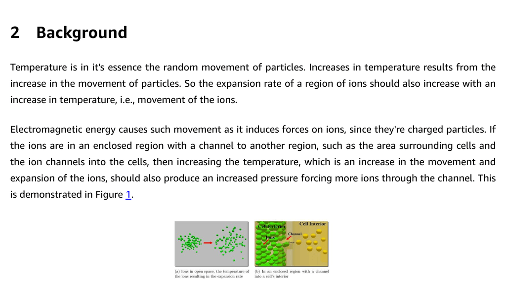

**Figure 1.** Thermoelastic pressure effects on ionic current through channels — [↑ Back to List of Figures](#figures)

The amount of current then, of the ions going through the channel, is a function of temperature. Since the voltage in the cell changes as a result of this current it means that the cell's voltage is also a function of temperature. Thus, changes in temperature would affect the cell's voltage and also its neural signaling.

For this research we wanted to determine whether this effect would occur as a result of temperature changes. Other research has found that just small changes in voltage gradients affect active neurons [[38]](#ref-38), so it's a plausible hypothesis that this would occur and it turns out that we have a way of determining this using the Nernst equation and the Hodgkin and Huxley's model of the neuron, for which they received the nobel prize in 1963 "for their discoveries concerning the ionic mechanisms involved in excitation and inhibition in the peripheral and central portions of the nerve cell membrane." [[32]](#ref-32).

Other research predicted using the Nernst equation that changes in temperature could affect membrane voltages and neural signaling [[4]](#ref-4). The 1984 paper stating that its use of the equation provides a starting point for a more complete theory. This work then is an answer for such a more complete theory and in order to determine whether these effects would occur and to quantify this effect, the Nernst equation is used with the biological realism of the Hodgkin-Huxley model of the neuron, connected in the form of neural networks.

The Nernst equation then is a way of calculating the voltages that are generated at the cell membrane as a result of different ionic concentrations on either side of the cell membrane with selective channels for specific ions.

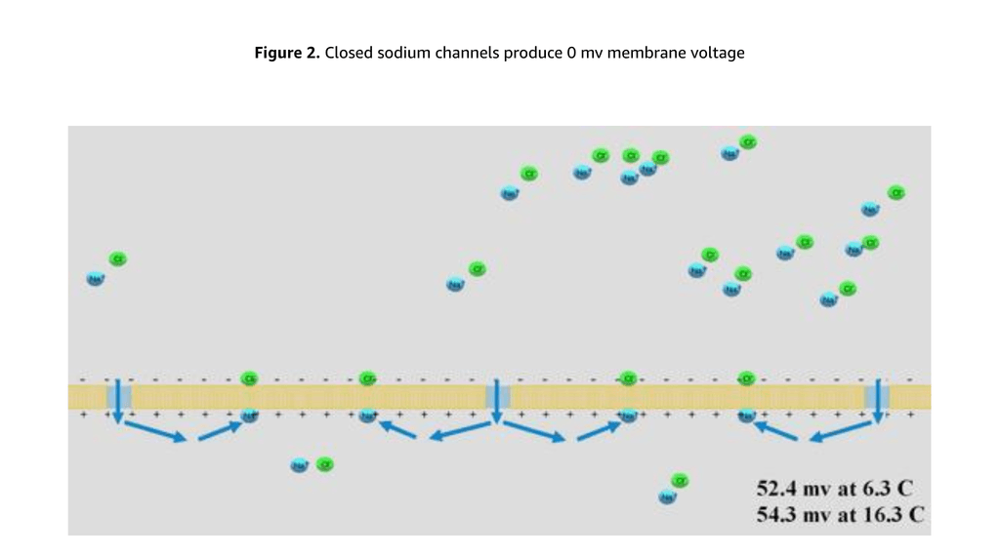

**Figure 2.** Closed sodium channels produce 0 mV membrane voltage — [↑ Back to List of Figures](#figures)

In [Figure 2](#figure-2) we have a concentration of sodium (Na+) and chloride (Cl-) ions where, just like a real cell at resting membrane potential, there are significantly more ions on the outside of the cell than the inside. Here the Na channels are closed.

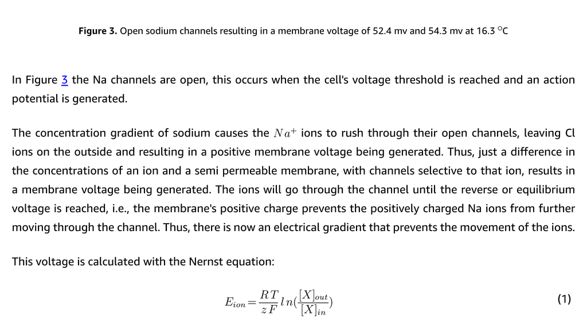

**Figure 3.** Open sodium channels resulting in a membrane voltage of 52.4 mV at 6.3°C and 54.3 mV at 16.3°C — [↑ Back to List of Figures](#figures)

In [Figure 3](#figure-3) the Na channels are open, this occurs when the cells voltage threshold is reached and an action potential is generated.

The concentration gradient of sodium causes the Na+ ions to rush through their open channels, leaving Cl ions on the outside and resulting in a positive membrane voltage being generated. Thus, just a difference in the concentrations of an ion and a semi permeable membrane, with channels selective to that ion, results in a membrane voltage being generated. The ions will go through the channel until the reverse or equilibrium voltage is reached, i.e., the membrane's positive charge prevents the positively charged Na ions from further moving through the channel. Thus, there is now an electrical gradient that prevents the movement of the ions.

This voltage is calculated with the **Nernst equation**:

$$E_{ion} = \frac{RT}{zF} \ln\frac{[X]_{out}}{[X]_{in}} \quad (1)$$

Where:
- E = equilibrium or reverse potential
- R = universal gas constant
- T = temperature in Kelvin
- z = valence of the ionic species (+1 for Na+, +2 for Ca2+, -1 for Cl-)
- F = Faraday's constant
- [X]out = concentration of ion outside
- [X]in = concentration of ion inside

So we can calculate the equilibrium potential, the voltage that such a concentration of Na ions would generate at specific temperatures. Here 6.3°C is used, because this is the temperature that the Hodgkin Huxley model was designed for, using the squid giant axon [[22]](#ref-22). Since we're analyzing changes in temperature and not the temperature itself, the results are equivalent for 6.3°C as they are at 37°C.

A 10°C temperature difference is also used for describing and illustrating the effects on equilibrium membrane potential, although this research finds that neurons are sensitive to just fractions of a degree, far beneath the conventional thermal level used for safety standards that are set to prevent a +1°C temperature increase.

The ADS electromagnetic weapon produces temperature increases on the surface of the skin far exceeding 10°C and using a different frequency with a greater penetration depth, this could also affect neurons. A 10°C increase over any significant amount of time would be lethal or cause serious permanent damage, however transient high energy pulses could be used where ions, that are charged particles would receive significant amounts of the energy and then the resulting heat quickly dissipating, causing neurological effects without lethality or serious permanent damage. Think about touching a hot stove for a fraction of a second. You sense the temperature without a resulting injury.

Such significant temperature increases are not required though, since this research finds that temperature increases significantly less than 1°C cause neurological effects. For description and illustration though, temperatures of 6.3°C and 16.3°C are used. These temperatures along with the ion concentrations for sodium of 440 outside and 50 inside the cell [[27]](#ref-27) produce equilibrium voltages of 52.4 mV and 54.3 mV using the Nernst equation. This is the required voltage inside the cell to prevent sodium from further entering it.

We will see that around a 2 mV difference such as this is very significant and that neurons are sensitive to far lower voltage differences.

Potassium (K+) is the another very significant ion involved in the action potential itself. Potassium ions are mostly on the inside of the cell, this occurs as a result of the ATPase pumps that also moves more sodium (Na+) ions to the outside of the cell. For every 2 (K+) it moves in it also moves 3 (Na+) out. This results in the concentrations of these ions.

There's also more negatively charged proteins on the inside of the cell, these cannot move through channels and contribute to the negative charge of the cell.

The potassium ions though are very significant in producing the resting membrane potential, generally around 65 mV. This is because the ion channels for potassium are reasonably open when the cell is at rest.

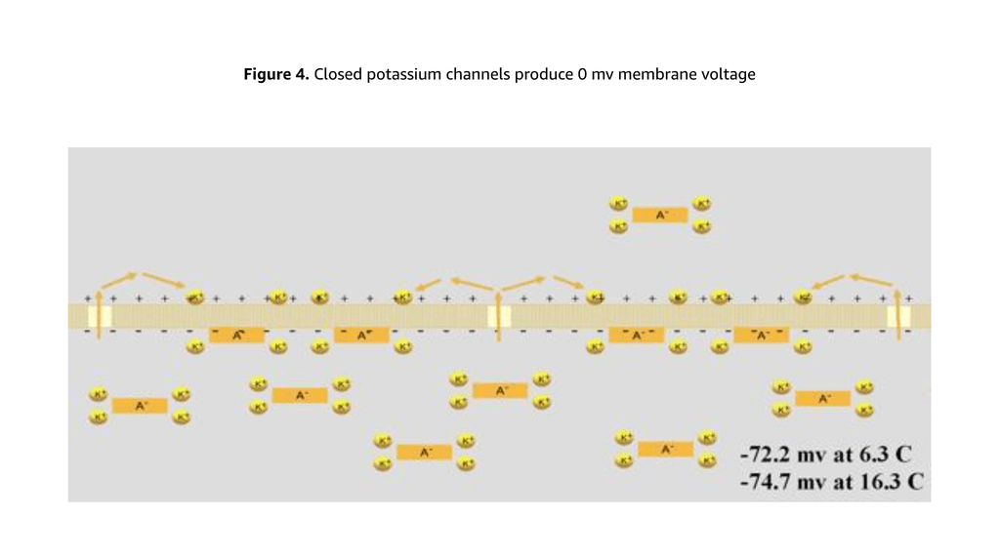

**Figure 4.** Closed potassium channels produce 0 mV membrane voltage — [↑ Back to List of Figures](#figures)

[Figure 4](#figure-4) shows that the cell has a 0 mV membrane voltage when these ion channels are closed.

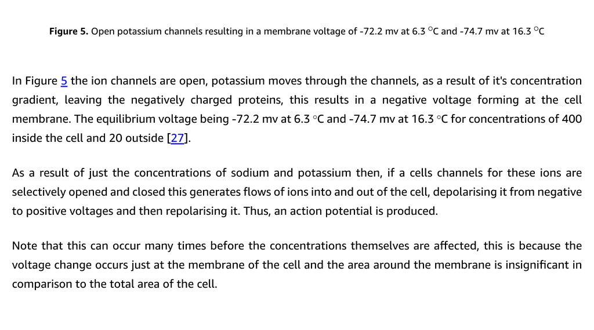

**Figure 5.** Open potassium channels resulting in a membrane voltage of -72.2 mV at 6.3°C and -74.7 mV at 16.3°C — [↑ Back to List of Figures](#figures)

In [Figure 5](#figure-5) the ion channels are open, potassium moves through the channels, as a result of it's concentration gradient, leaving the negatively charged proteins, this results in a negative voltage forming at the cell membrane. The equilibrium voltage being -72.2 mV at 6.3°C and -74.7 mV at 16.3°C for concentrations of 400 inside the cell and 20 outside [[27]](#ref-27).

As a result of just the concentrations of sodium and potassium then, if a cells channels for these ions are selectively opened and closed this generates flows of ions into and out of the cell, depolarising it from negative to positive voltages and then repolarising it. Thus, an action potential is produced.

Note that this can occur many times before the concentrations themselves are affected, this is because the voltage change occurs just at the membrane of the cell and the area around the membrane is insignificant in comparison to the total area of the cell.

> "1/3,000,000 to 1/100,000,000 of the total positive charges inside the fiber must be transferred. Also, an equally small number of positive ions moving from outside to inside the fiber can reverse the potential from -90 millivolts to as much as +35 millivolts within as little as 1/10,000 of a second" [[18]](#ref-18).

When the concentrations are eventually affected, after many action potentials, the ATPase pumps restore them. Thus, the concentrations remain the same in the Hodgkin Huxley calculations.

[↑ Back to Table of Contents](#toc)

---

## 3 Methods

### 3.1 Temperature Sensitive Neuron Model

The original Hodgkin-Huxley equations for a neuron used constants for the equilibrium potentials. Here we want to determine the effects of temperature on the cell, the currents, the voltage and the signaling, so the Nernst equation (1) is used to calculate the equilibrium voltage values at different temperatures that are then used in the Hodgkin and Huxley equations for the ionic currents that then affect the membrane voltages and signaling:

$$I_{Na} = \bar{g}_{Na} \cdot h \cdot m^3 (V - E_{Na^+}) \quad (2)$$

$$I_K = \bar{g}_K \cdot n^4 (V - E_{K^+}) \quad (3)$$

$$I_{Cl} = \bar{g}_{Cl^-} (V - E_{Cl^-}) \quad (4)$$

Where:
- I_Na, I_K, I_Cl = currents for sodium, potassium and chloride
- g_ion = maximum conductance for the ion in millisiemens per centimeter squared (mS/cm²)
- Values from Hodgkin and Huxley: g_Na+ = 120 mS/cm², g_K+ = 36 mS/cm², g_Cl- = 0.3 mS/cm² [[22]](#ref-22)
- V = membrane voltage
- E_ion = equilibrium potential for each ion (calculated via Nernst equation)
- m = gating variable for sodium (how open it is)
- h = inactivation variable that closes sodium channel after depolarization
- n = gating variable for potassium

Note that these equations are essentially of the form of **Ohm's law** that states the relationship between current, voltage and resistance:

$$I = \frac{V}{R} \quad (5)$$

This can also be written in terms of conductance:

$$R = \frac{1}{G} \quad (6)$$

Thus:

$$I = VG \quad (7)$$

(V - E_ion) in equations (2), (3) and (4) can then be thought of as the driving force or voltage that determines the ionic current. Since E_ion is determined according to the Nernst equation (1) and is a function of temperature, it then means that the driving force and thus, current is also a function of temperature.

In order to determine the changes in membrane voltage from current the following equation (8) from Hodgkin and Huxley is used:

$$C \frac{dV}{dt} = I_{Na} + I_K + I_{Cl} + I_{stimulus} \quad (8)$$

Where C dV/dt is the capacitive current caused from the total flow of the currents (I_Na, I_K, I_Cl) and also a stimulus current I_stimulus.

The physiologists convention [[5]](#ref-5) is used since outward currents of positive charge is defined as positive and decreasing membrane voltage and inward currents of positive charge as negative and increasing membrane voltage. Thus, a positive current of K+ is flowing out of the cell and reduces membrane voltage and a negative current of Na+ is flowing into the cell, increasing membrane voltage. A positive stimulus though, is flowing into the cell and a negative stimulus flowing out.

So equation 8 is rewritten as:

$$C \frac{dV}{dt} = I_{stimulus} - (I_{Na} + I_K + I_{Cl}) \quad (9)$$

The change in membrane voltage is then:

$$\frac{dV}{dt} = \frac{I_{stimulus} - (I_{Na} + I_K + I_{Cl})}{C} \quad (10)$$

Thus, the membrane voltage of the cell is a function of the currents and these are a function of temperature and this is used to determine the effect of temperature changes on neural signaling.

Hodgkin and Huxley do mention the use of a **Q10 factor** to adjust for temperature the α_i and β_i rates used to determine how open or closed the various ion channels are as a function of voltage. A Q10 of 3 is stated [[22]](#ref-22) and is used in these equations.

These then are the equations used to determine the α_i and β_i rates at which the channels open and close:

$$\alpha_m = \frac{0.1(V + 25.0)}{e^{(V+25.0)/10.0} - 1.0} Q_{10Adj} \quad (11)$$

$$\beta_m = 4.0 e^{-V/18.0} Q_{10Adj} \quad (12)$$

$$\alpha_h = 0.07 e^{-V/20.0} Q_{10Adj} \quad (13)$$

$$\beta_h = \frac{1.0}{e^{(V+30)/10} + 1.0} Q_{10Adj} \quad (14)$$

$$\alpha_n = \frac{0.01(V + 10.0)}{e^{(V+10.0)/10.0} - 1.0} Q_{10Adj} \quad (15)$$

$$\beta_n = 0.125 e^{V/80.0} Q_{10Adj} \quad (16)$$

Where **Q10Adj** is a scaling factor using the stated Q10 of 3 and defined as:

$$Q_{10Adj} = 3^{(Temp - SQUID_{temp})/10} \quad (17)$$

- Temp is the current temperature of the neuron
- SQUID_temp is the 6.3°C temperature for the squid neuron that the Hodgkin and Huxley equations were originally designed for

The α_i and β_i rates adjusted for temperature are then used in equations (18), (19) and (20) to determine the changes in the probability of the sodium and potassium channels being open:

$$\frac{dm}{dt} = \alpha_m(V)(1-m) - \beta_m(V)m \quad (18)$$

$$\frac{dh}{dt} = \alpha_h(V)(1-h) - \beta_h(V)h \quad (19)$$

$$\frac{dn}{dt} = \alpha_n(V)(1-n) - \beta_n(V)n \quad (20)$$

Thus, these equations are used to determine the ionic currents, the change in the membrane voltage and the opening and closing of the channels as functions of voltage, time and temperature of a neuron.

[↑ Back to Table of Contents](#toc)

### 3.2 Temperature Sensitive Neural Network

Another hypothesis of this work is that connected neurons amplify the effect of temperature increases. In order to determine this the neurons are connected in the form of a neural networks at normal temperature and various other temperatures. All the networks have the same weights and all the other variables are the same except for temperature. Thus, when the networks are at the same temperature they behave the exact same way. This then allows us to test the effect of different temperatures on the networks.

For the pre-synaptic neuron stimulus going into the post-synaptic neuron, excitatory stimulus is modeled using the sodium channels, multiplying the active weights with the conductance for sodium and the driving voltage (the difference between the membrane voltage and the equilibrium voltage for sodium).

For the inhibitory GABA effect the chloride channel is modeled. The driving voltage for chloride (the membrane voltage less the chloride equilibrium voltage) is not as strong as that of sodium and so the conductance for the chloride channel is increased, otherwise the excitatory neural connections would produce excessive activations. The neural activations are then balanced with biologically realistic inhibitory and excitatory effects throughout the network, producing activated and inactivated neurons.

The following equations are used to determine the input synaptic current from the activity of the connected neurons. First for the excitatory connection strengths:

$$S_{jEx} = \sum_{i=1}^{n} a_i s_{ij} [s_{ij} > 0] \quad (21)$$

Where:
- S_jEx = total excitatory connection strength of the active pre-synaptic neurons to neuron j
- a_i = activity of the connected pre-synaptic neuron (0 or 1)
- s_ij = strength of the connection from neuron i to neuron j
- [s_ij > 0] = Iverson notation (evaluates to 1 if true, otherwise 0)
- n = number of connections

Equation (22) is for the strength of the inhibitory connections:

$$S_{jInh} = \sum_{i=1}^{n} a_i s_{ij} [s_{ij} < 0] \quad (22)$$

Pre-synaptic neurons are considered to be active and signaling if their membrane voltage is greater than 20 mV, thus simulating the effect in biological neurons of voltage gated calcium channels opening, causing vesicles in the pre-synaptic neuron to release neurotransmitters that open the ligand gated ion channels on the post synaptic neuron and further transmitting the signal.

The total synaptic input current for a neuron is then calculated according to:

$$I_{jEx} = -S_{jEx} \bar{g}_{Na^+_{syn}} (V - E_{Na^+}) \quad (23)$$

$$I_{jInh} = S_{jInh} \bar{g}_{Cl^-_{syn}} (V - E_{Cl^-}) \quad (24)$$

$$I_j = I_{jEx} + I_{jInh} + n \quad (25)$$

Where:
- I_jEx = total excitatory input current for neuron j
- I_jInh = total inhibitory input current into the neuron
- I_j = total input current from all pre-synaptic neurons into post-synaptic neuron j
- ḡ_Na+_syn and ḡ_Cl-_syn = maximum sodium and chloride conductance for post-synaptic input channels
- n = noise intensity input current value

For this work it was found that values for the maximum sodium and chloride conductance of **ḡ_Na+_syn = 8 mS/cm²** and **ḡ_Cl-_syn = 230 mS/cm²** produced the required balance of excitatory and inhibitory currents.

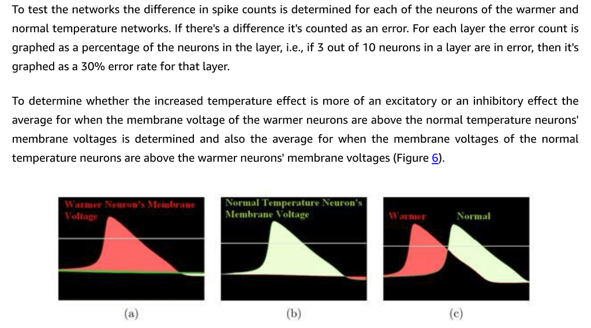

**Figure 6.** Method to determine degree of excitatory or inhibitory effect. Difference in membrane voltages is summed and averaged for all neurons in a layer. Red region equates to excitatory effect, where the warmer membrane voltage is above the voltage at normal temperature, with the green region equating to an inhibitory effect. — [↑ Back to List of Figures](#figures)

[↑ Back to Table of Contents](#toc)

### 3.3 Artificial Life Food Finding Task

The networks are also tested in the form of artificial life agents with the task of finding food.

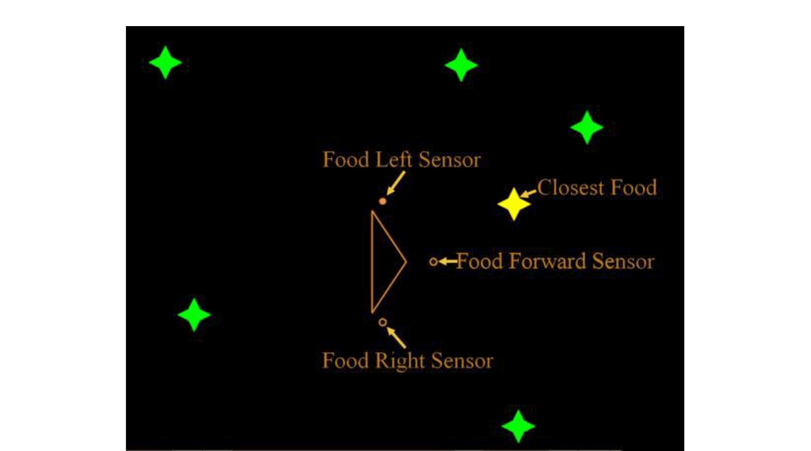

**Figure 7.** Graphical representation of the neural network's agent and environment — [↑ Back to List of Figures](#figures)

The 3 input neurons receive the direction toward the food and the output layer encodes the action. The visual range for the agent is 360°, with a 20° field of view for the center, move forward neuron and the other two receiving 170°.

| Food Direction | Input Activations | Example Output | Action |
|----------------|-------------------|----------------|--------|
| Right | 001 | 1001111010 | Turn Right |
| Forward | 010 | 0001101110 | Move Forward |
| Left | 100 | 0110010111 | Turn Left |

**Table 1.** Direction of food to action

For training the network the correct action is specified for the output layer activations. If a temperature increase results in the neural network being affected and the output deviating from this then it will result in the incorrect action and thus, affects the agent's ability to find food.

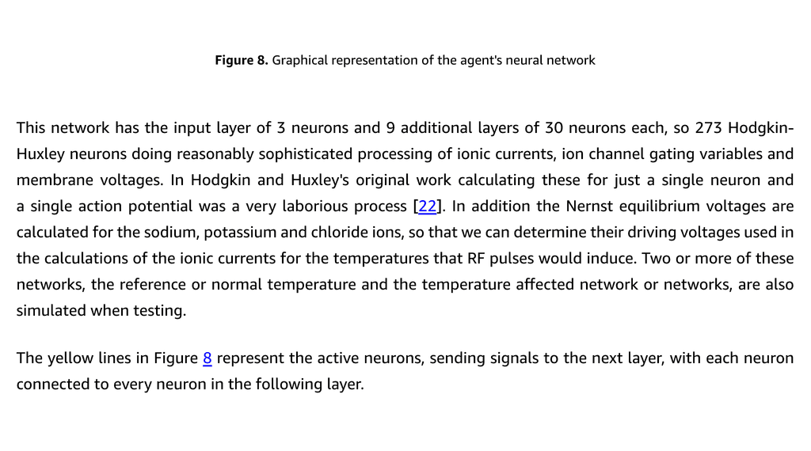

**Figure 8.** Graphical representation of the agent's neural network — [↑ Back to List of Figures](#figures)

This network has the input layer of 3 neurons and 9 additional layers of 30 neurons each, so **273 Hodgkin-Huxley neurons** doing reasonably sophisticated processing of ionic currents, ion channel gating variables and membrane voltages.

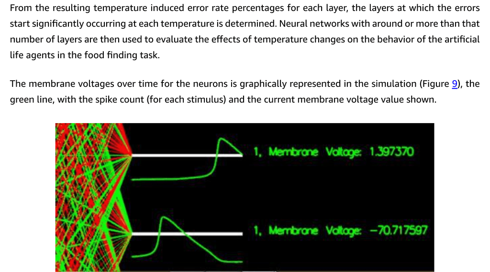

**Figure 9.** Graphical representation of the neurons' membrane voltages — [↑ Back to List of Figures](#figures)

[↑ Back to Table of Contents](#toc)

---

## 4 Results

### 4.1 Effect on Equilibrium and Membrane Voltages

First, the effects on neurological processing from the results of a 10°C increase are demonstrated.

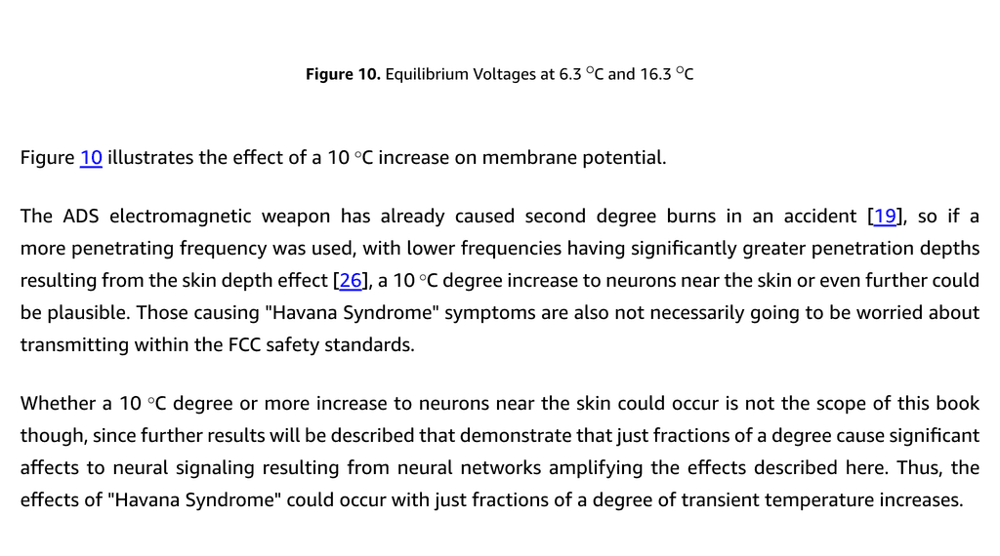

**Figure 10.** Equilibrium Voltages at 6.3°C and 16.3°C — [↑ Back to List of Figures](#figures)

[Figure 10](#figure-10) illustrates the effect of a 10°C increase on membrane potential.

The ADS electromagnetic weapon has already caused second degree burns in an accident [[19]](#ref-19), so if a more penetrating frequency was used, with lower frequencies having significantly greater penetration depths resulting from the skin depth effect [[26]](#ref-26), a 10°C degree increase to neurons near the skin or even further could be plausible. Those causing "Havana Syndrome" symptoms are also not necessarily going to be worried about transmitting within the FCC safety standards.

Whether a 10°C degree or more increase to neurons near the skin could occur is not the scope of this book though, since further results will be described that demonstrate that **just fractions of a degree cause significant affects to neural signaling** resulting from neural networks amplifying the effects described here.

The current safety standards are also designed around preventing an increase in temperature of more than 1°C [[3]](#ref-3). This is used to determine the signal strengths that cell phones etc are allowed to transmit at and so the findings of this research is also very significant in terms of the setting of the safety standards.

We've seen in [Figure 10](#figure-10) the effects of a 10°C increase in temperature on the equilibrium voltages of a neuron. The around 2 mV change is very significant in reference to the threshold voltage, of around -55 mV, also shown on the graph in Figure 10(a), when there's an average membrane voltage between -60 mV and -70 mV.

Note that the temperature increase shifts the equilibrium voltages and because the membrane voltage results from the equilibrium voltages (that can be calculated from the Goldman equation) it also shifts the membrane voltage further from threshold.

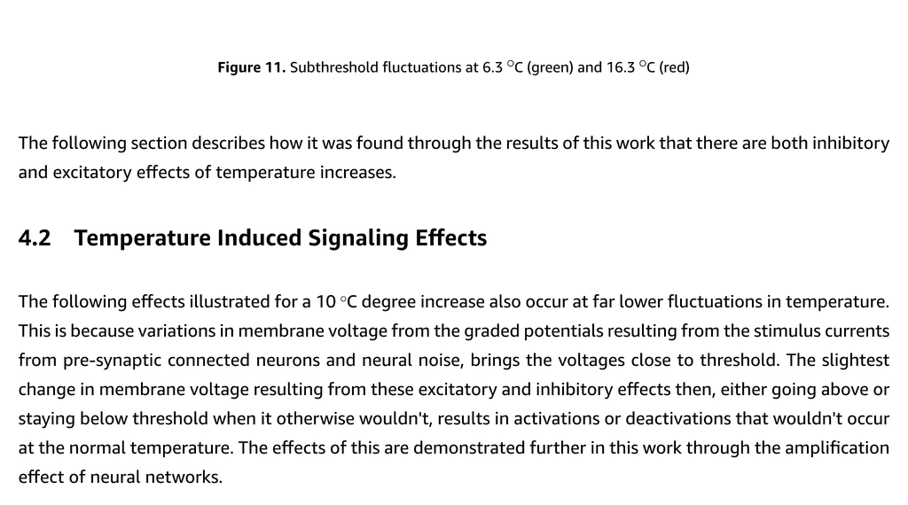

**Figure 11.** Subthreshold fluctuations at 6.3°C (green) and 16.3°C (red) — [↑ Back to List of Figures](#figures)

Clearly, the same fluctuations in membrane voltage could cause the normal temperature neuron to activate and not the warmer (in red).

[↑ Back to Table of Contents](#toc)

### 4.2 Temperature Induced Signaling Effects

The following effects illustrated for a 10°C degree increase also occur at far lower fluctuations in temperature. This is because variations in membrane voltage from the graded potentials resulting from the stimulus currents from pre-synaptic connected neurons and neural noise, brings the voltages close to threshold. The slightest change in membrane voltage resulting from these excitatory and inhibitory effects then, either going above or staying below threshold when it otherwise wouldn't, results in activations or deactivations that wouldn't occur at the normal temperature.

### 4.3 Further From Threshold Inhibition

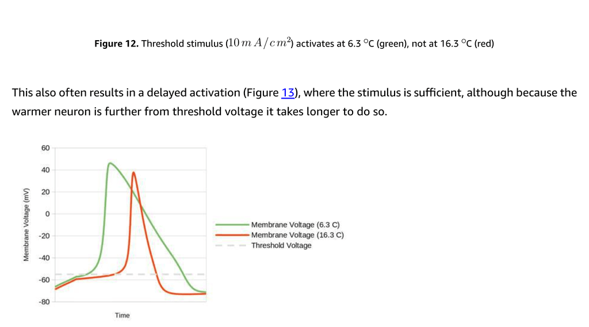

**Figure 12.** Threshold stimulus (10 mA/cm²) activates at 6.3°C (green), not at 16.3°C (red) — [↑ Back to List of Figures](#figures)

[Figure 12](#figure-12) shows the result of a 10 mA/cm², 1 millisecond stimulus activating the neuron at 6.3°C and not at 16.3°C, since the normal temperature neuron's membrane voltage is closer to the threshold. This then is an **inhibitory effect**.

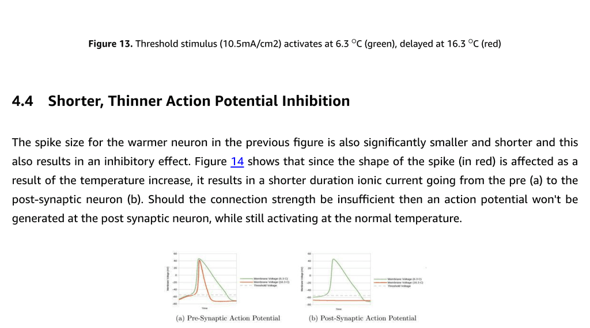

**Figure 13.** Threshold stimulus (10.5 mA/cm²) activates at 6.3°C (green), delayed at 16.3°C (red) — [↑ Back to List of Figures](#figures)

This also often results in a delayed activation ([Figure 13](#figure-13)), where the stimulus is sufficient, although because the warmer neuron is further from threshold voltage it takes longer to do so.

[↑ Back to Table of Contents](#toc)

### 4.4 Shorter, Thinner Action Potential Inhibition

The spike size for the warmer neuron in the previous figure is also significantly smaller and shorter and this also results in an inhibitory effect.

**Figure 14.** Pre-synaptic action potential spike for 16.3°C neuron (a) insufficient to activate post-synaptic action potential spike (b), although activates at 6.3°C — [↑ Back to List of Figures](#figures)

This could also result in delayed activations, the same as the further from threshold inhibitory effect ([Figure 13](#figure-13)), since the post-synaptic neuron is receiving less stimulus from the thinner, shorter pre-synaptic neuron.

[↑ Back to Table of Contents](#toc)

### 4.5 Increased Spike Rate Frequency Excitation

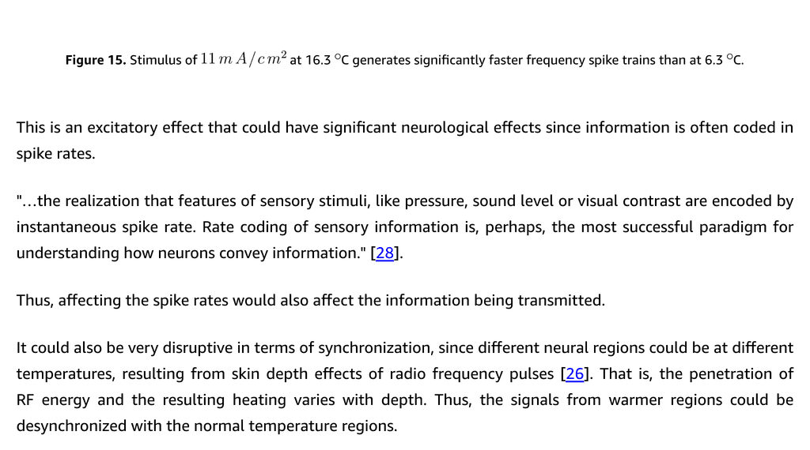

**Figure 15.** Stimulus of 11 mA/cm² at 16.3°C generates significantly faster frequency spike trains than at 6.3°C — [↑ Back to List of Figures](#figures)

It's also found that when there is sufficient connection strength between the neurons, that a train of spikes is generated at the pre and post-synaptic neuron that is of a higher frequency than at the normal temperature. This is an **excitatory effect** that could have significant neurological effects since information is often coded in spike rates.

> "...the realization that features of sensory stimuli, like pressure, sound level or visual contrast are encoded by instantaneous spike rate. Rate coding of sensory information is, perhaps, the most successful paradigm for understanding how neurons convey information." [[28]](#ref-28).

[↑ Back to Table of Contents](#toc)

### 4.6 Temperature Pulse Induced Anode Break Excitation

There is also an excitatory effect that can result when a membrane voltage is temporarily made more negative and then released, referred to as **anode break excitation** [[22]](#ref-22), that ordinarily occurs from a negative, inhibitory stimulus current. This work shows that pulsed temperature increases, that electromagnetic radio and microwave energy cause, could also result in the same activation effect.

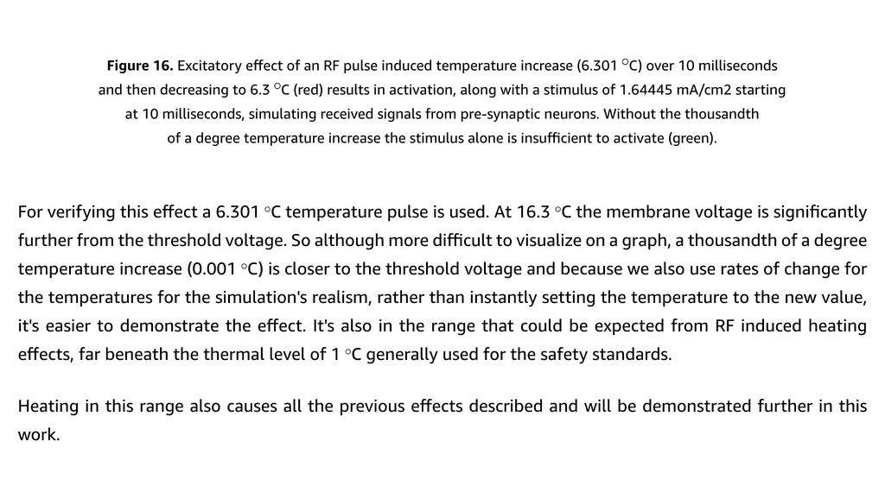

**Figure 16.** Excitatory effect of an RF pulse induced temperature increase (6.301°C) over 10 milliseconds and then decreasing to 6.3°C (red) results in activation, along with a stimulus of 1.64445 mA/cm² starting at 10 milliseconds. Without the thousandth of a degree temperature increase the stimulus alone is insufficient to activate (green). — [↑ Back to List of Figures](#figures)

For verifying this effect a 6.301°C temperature pulse is used. A thousandth of a degree temperature increase (0.001°C) is closer to the threshold voltage and it's also in the range that could be expected from RF induced heating effects, far beneath the thermal level of 1°C generally used for the safety standards.

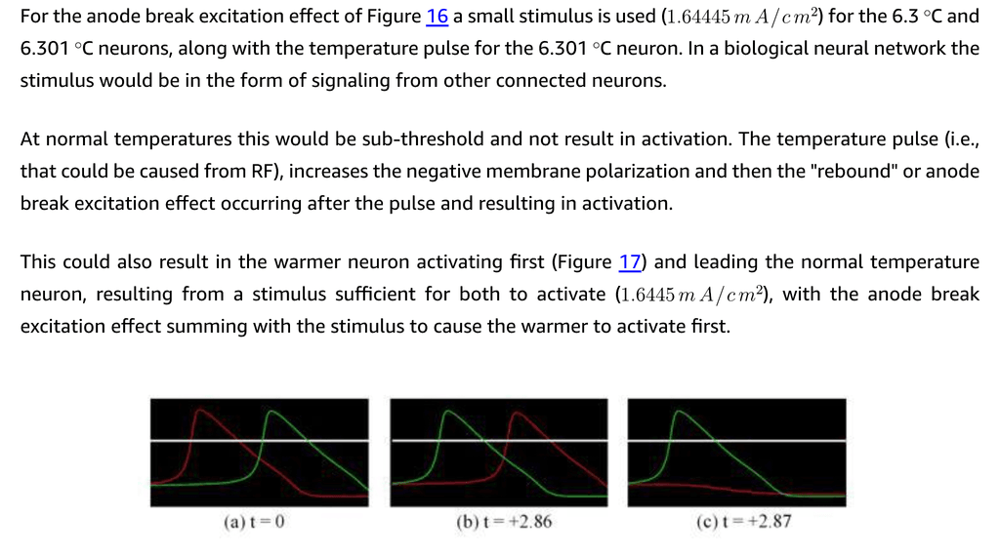

**Figure 17.** Excitatory (anode break excitation) and further from threshold inhibitory effects resulting from simulated temperature increases from an RF pulse deactivating at different times, where t is the difference in time between the end of the RF pulse and the start of the stimulus. — [↑ Back to List of Figures](#figures)

Note that the extent to which the pulse leads or lags is also determined according to when the RF pulse deactivates. Thus, the timing of the RF pulse's deactivation is very significant and can result in a range of effects from very excitatory to very inhibitory. Since synchronization is very significant in neural networks, these then also cause further effects.

This work then describes and verifies:
- **Two inhibitory effects**: "Further From Threshold Inhibition", "Shorter, Thinner Action Potential Inhibition"
- **Two excitatory effects**: "Increased Spike Rate Frequency Excitation", "Temperature Pulse Induced Anode Break Excitation"

[↑ Back to Table of Contents](#toc)

### 4.7 Neural Network Amplification of RF Effects on Signaling

This work also found that neural networks have a very significant amplification of RF induced temperature effects. The more connections a network has the greater the effect.

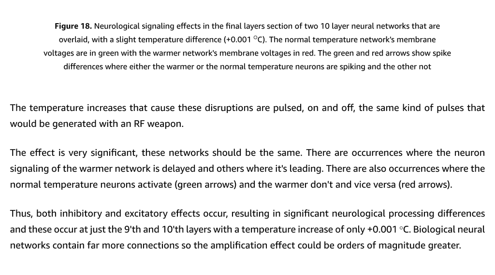

**Figure 18.** Neurological signaling effects in the final layers section of two 10 layer neural networks that are overlaid, with a slight temperature difference (+0.001°C). The normal temperature network's membrane voltages are in green with the warmer network's membrane voltages in red. — [↑ Back to List of Figures](#figures)

The temperature increases that cause these disruptions are pulsed, on and off, the same kind of pulses that would be generated with an RF weapon.

The effect is very significant, these networks should be the same. There are occurrences where the neuron signaling of the warmer network is delayed and others where it's leading. There are also occurrences where the normal temperature neurons activate (green arrows) and the warmer don't and vice versa (red arrows).

Thus, both inhibitory and excitatory effects occur, resulting in significant neurological processing differences and these occur at just the 9th and 10th layers with a temperature increase of only +0.001°C. **Biological neural networks contain far more connections so the amplification effect could be orders of magnitude greater.**

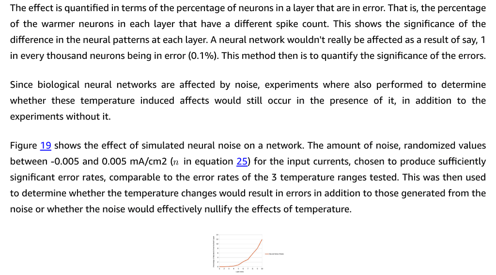

**Figure 19.** Average percentage of neurons in error resulting from neural noise for each of the 10 layers, averaged over 30 trials (average standard deviation 2.25%) — [↑ Back to List of Figures](#figures)

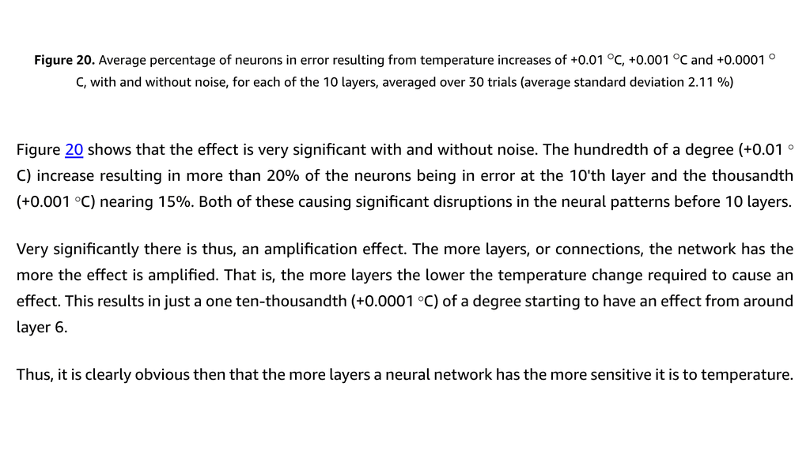

**Figure 20.** Average percentage of neurons in error resulting from temperature increases of +0.01°C, +0.001°C and +0.0001°C, with and without noise, for each of the 10 layers, averaged over 30 trials (average standard deviation 2.11%) — [↑ Back to List of Figures](#figures)

[Figure 20](#figure-20) shows that the effect is very significant with and without noise:
- The hundredth of a degree (+0.01°C) increase resulting in **more than 20% of the neurons being in error** at the 10th layer
- The thousandth (+0.001°C) nearing **15%**
- **Even a one ten-thousandth (+0.0001°C) of a degree starting to have an effect from around layer 6**

**Very significantly there is thus, an amplification effect. The more layers, or connections, the network has the more the effect is amplified.**

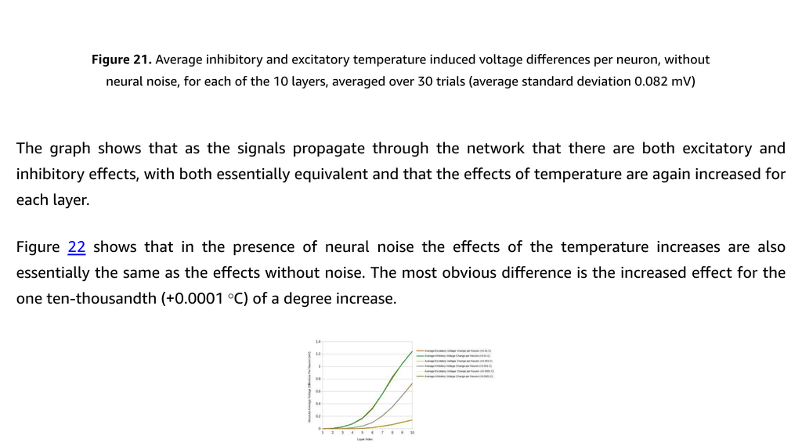

**Figure 21.** Average inhibitory and excitatory temperature induced voltage differences per neuron, without neural noise, for each of the 10 layers, averaged over 30 trials — [↑ Back to List of Figures](#figures)

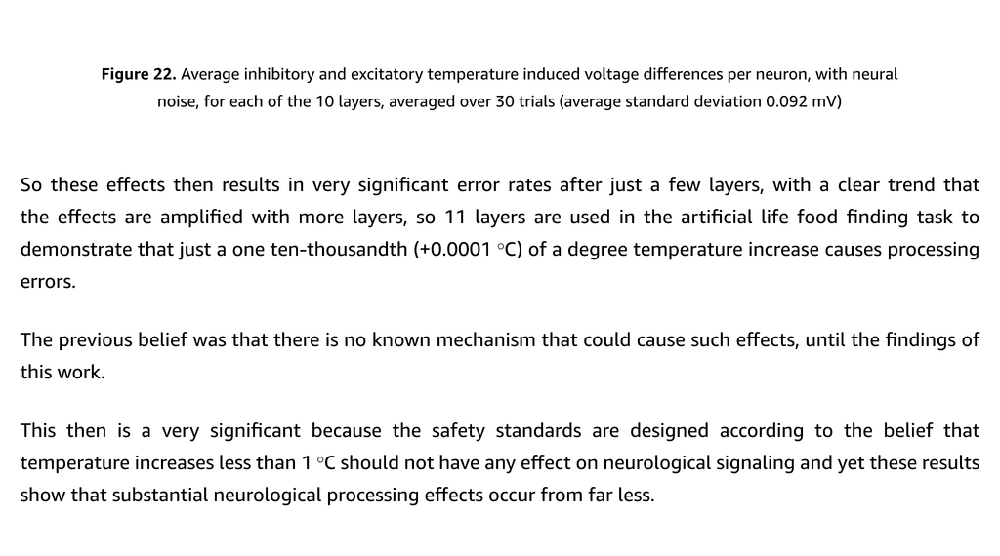

**Figure 22.** Average inhibitory and excitatory temperature induced voltage differences per neuron, with neural noise, for each of the 10 layers, averaged over 30 trials — [↑ Back to List of Figures](#figures)

This then is very significant because the safety standards are designed according to the belief that temperature increases less than 1°C should not have any effect on neurological signaling and yet these results show that substantial neurological processing effects occur from far less.

[↑ Back to Table of Contents](#toc)

### 4.8 Results of the Artificial Life Food Finding Task

To further test the effects of pulsed RF energy induced temperature changes, an artificial life food finding task is used.

**Figure 23.** Trace of an artificial life agent's decisions at normal temperature, navigating towards food. The green outlined objects represent food that was successfully found. — [↑ Back to List of Figures](#figures)

Since the graphs of [Figures 20](#figure-20), [21](#figure-21) and [22](#figure-22) show that for the lowest temperature increase (+0.0001°C) the effect is reasonably significant at around the 10th layer, near an error percentage of 3.5%, or around 1 neuron in the 30 for a layer in error and because the effect becomes more significant with further layers, an 11 layer neural network is chosen to determine the effect on the agent's behavior in the food finding task.

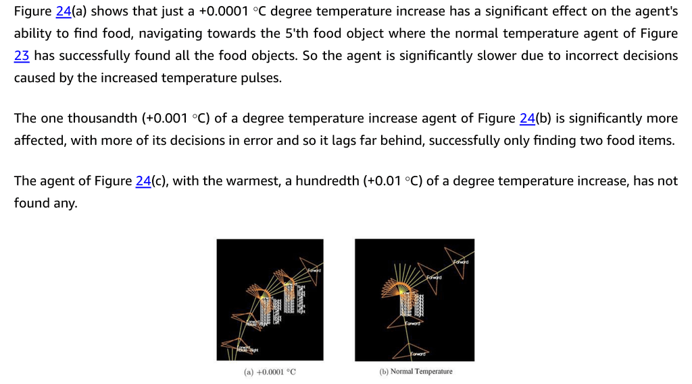

**Figure 24.** Traces of agents being affected at various temperatures: (a) +0.0001°C, (b) +0.001°C, (c) +0.01°C. The yellow object is the closest food and the solid green objects represent uneaten food. — [↑ Back to List of Figures](#figures)

Results:
- **(a) +0.0001°C**: Agent finds 4 food items (significantly slower due to incorrect decisions)
- **(b) +0.001°C**: Agent finds only 2 food items
- **(c) +0.01°C**: Agent finds **no food items**

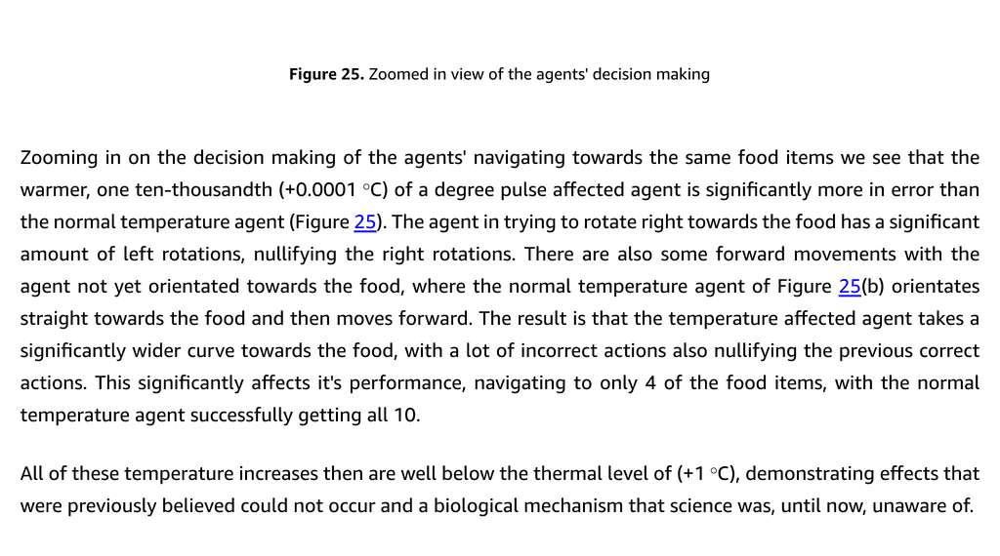

**Figure 25.** Zoomed in view of the agents' decision making — [↑ Back to List of Figures](#figures)

All of these temperature increases then are well below the thermal level of (+1°C), demonstrating effects that were previously believed could not occur and a biological mechanism that science was, until now, unaware of.

This is also using a neural network with just 11 layers and we've established that the effect increases with more layers or connections. **It's obvious then that this effect should be orders of magnitude greater with biological neural networks, that have billions of neurons and trillions of connections.**

[↑ Back to Table of Contents](#toc)

---

## 5 Discussion

So we've verified that sub-thermal temperature increases have a significant effect. Ionic currents, membrane voltage and thus, signaling is a function of temperature. Here it's described in more detail why this effect is so significant in terms of these results showing that neural networks amplify this effect, through increased connections.

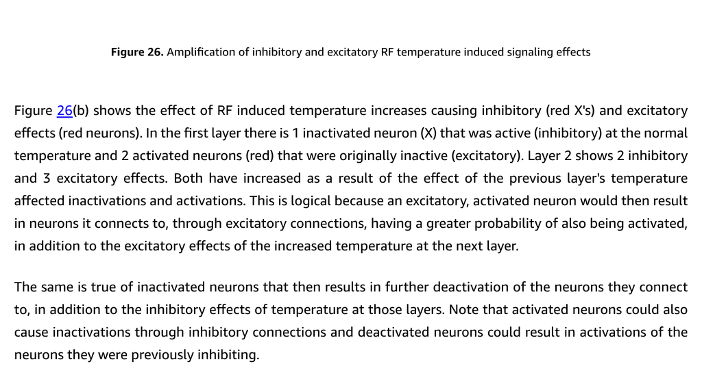

**Figure 26.** Amplification of inhibitory and excitatory RF temperature induced signaling effects — [↑ Back to List of Figures](#figures)

[Figure 26](#figure-26)(a) shows a neural network with activated neurons (gold), the previous layers activations resulting in activating additional neurons in the layers below.

[Figure 26](#figure-26)(b) shows the effect of RF induced temperature increases causing inhibitory (red X's) and excitatory effects (red neurons). In the first layer there is 1 inactivated neuron (X) that was active (inhibitory) at the normal temperature and 2 activated neurons (red) that were originally inactive (excitatory). Layer 2 shows 2 inhibitory and 3 excitatory effects. Both have increased as a result of the effect of the previous layer's temperature affected inactivations and activations.

**Key insight:** These effects cause further activations and deactivations that wouldn't otherwise occur in addition to the effects of temperature at the next layers.

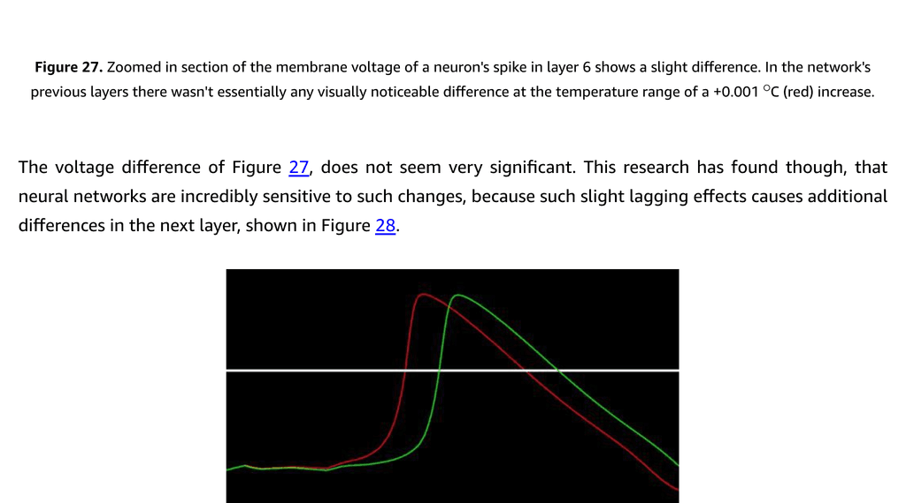

**Figure 27.** Zoomed in section of the membrane voltage of a neuron's spike in layer 6 shows a slight difference. In the network's previous layers there wasn't essentially any visually noticeable difference at the temperature range of a +0.001°C (red) increase. — [↑ Back to List of Figures](#figures)

The voltage difference of [Figure 27](#figure-27) does not seem very significant. This research has found though, that **neural networks are incredibly sensitive to such changes**, because such slight lagging effects causes additional differences in the next layer.

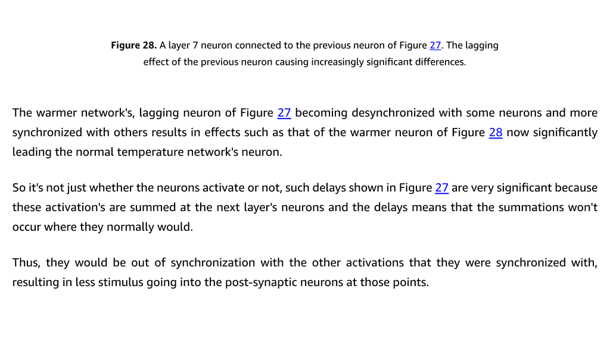

**Figure 28.** A layer 7 neuron connected to the previous neuron of [Figure 27](#figure-27). The lagging effect of the previous neuron causing increasingly significant differences. — [↑ Back to List of Figures](#figures)

The warmer network's, lagging neuron of [Figure 27](#figure-27) becoming desynchronized with some neurons and more synchronized with others results in effects such as that of the warmer neuron of [Figure 28](#figure-28) now significantly leading the normal temperature network's neuron.

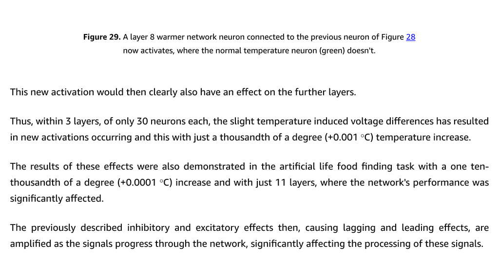

**Figure 29.** A layer 8 warmer network neuron connected to the previous neuron of [Figure 28](#figure-28) now activates, where the normal temperature neuron (green) doesn't. — [↑ Back to List of Figures](#figures)

Thus, within 3 layers, of only 30 neurons each, the slight temperature induced voltage differences has resulted in new activations occurring and this with just a thousandth of a degree (+0.001°C) temperature increase.

### Key Points from Discussion

1. **Amplification Mechanism**: It's not just whether neurons activate or not—effects to timing are very significant and this is amplified as signals transmit from one layer to the next.

2. **Biological Networks**: The feedforward networks used for testing here are simpler than biological networks which have significant amounts of recurrent or feedback connections, where signals are processed and then fed back. This creates additional summation over time.

3. **Neural Noise**: Although biological neural networks are adapted to noise, the temperature-induced errors are an additional effect that would cause cognitive difficulties and other neurological symptoms.

4. **Stochastic Resonance**: Neural noise could facilitate these effects by bringing membrane voltages closer to threshold where activations then occur [[14]](#ref-14).

5. **Pulsed vs Continuous**: It's the milli and microsecond pulses that cause temperature changes at rates that biology is not adapted to. Continuous wave energy would result in gradual, predictable temperature changes that can be adapted to. **Pulsed RF creates unpredictable fluctuations.**

6. **No Natural Analog**: There isn't any natural cause of the unpredictable temperature fluctuations resulting from pulsed radio and electromagnetic energy, so biological neural networks would not be adapted to these effects.

7. **Salt Water Antennas**: The US Navy and others [[33]](#ref-33)[[42]](#ref-42)[[43]](#ref-43) have successfully created salt water antennas using sodium and chloride ions—the same ions used by neurons:

> **"...the technology will be able to use the salt solution in human bodies to turn body parts into communications antennas..."** [[35]](#ref-35)

[↑ Back to Table of Contents](#toc)

---

## 6 Conclusion

The research results of this work are a **paradigm shift** in our understanding of how RF energy affects biology and neurological signaling.

### Key Findings

1. **RF energy induced temperature changes**, that cause thermoelastic pressure waves and the microwave hearing effect, also directly affect ionic equilibrium voltages and thus, currents and membrane voltages, affecting signaling and resulting in the entire range of the various neurological symptoms of Havana Syndrome.

2. **Neural networks are receivers and also very significant amplifiers** of the effects of RF energy induced temperature changes on membrane voltages, since the effects on the neurons' signaling are transmitted through their connections to other neurons.

3. **Sub-thermal effects are real**: Rather than just the fields locally influencing neurons, the effects of electromagnetic energy are summed over large regions of neural networks, resulting in significant amplification of the RF energy induced temperature effects. This is analogous to a lens that focuses light energy from a larger region.

4. **Safety standards are inadequate**: This is very significant for the setting of RF energy safety standards, since this is also the mechanism that causes sub-thermal neurological effects that the scientific community has been searching for.

5. **Weaponization potential**: Weaponizing this would result in the ability to seriously disrupt neurological patterns, causing functional damage to widespread brain networks and the range of symptoms of the national and international security threat that is Havana Syndrome.

[↑ Back to Table of Contents](#toc)

---

## Acknowledgments

For all those that facilitated this research.

---

## Supplementary Materials

The code used in the Hodgkin-Huxley simulations is available from:

**Website:** [www.mcleanresearchinstitute.com](https://www.mcleanresearchinstitute.com)

**GitHub:** [https://github.com/ClintMclean74/Hodgkin-HuxleyCode](https://github.com/ClintMclean74/Hodgkin-HuxleyCode)

[↑ Back to Table of Contents](#toc)

---

## Bibliography

[1] Costas Anastassiou, Rodrigo Perin, Henry Markram, and Christof Koch. Ephaptic coupling of cortical neurons. *Nature neuroscience*, 14:217–23, 02 2011. [↑](#1-introduction)

[2] ARRL Handbook for Radio Amateurs. American Radio Relay League, 1997. [↑](#1-introduction)

[3] William Bailey et al. Synopsis of IEEE Std C95.1™-2019 "IEEE Standard for Safety Levels with Respect to Human Exposure to Electric, Magnetic, and Electromagnetic Fields, 0 Hz to 300 GHz". *IEEE Access*, 7:171346–171356, 11 2019. [↑](#1-introduction)

[4] Frank S. Barnes. Cell membrane temperature rate sensitivity predicted from the Nernst equation. *Bioelectromagnetics*, 5(1):113–115, 1984. [↑](#2-background)

[5] James Bower and D. Beeman. The Book of GENESIS. 01 1998. [↑](#31-temperature-sensitive-neuron-model)

[6] C.C. Chiang et al. Slow periodic activity in the longitudinal hippocampal slice can self propagate non synaptically - by a mechanism consistent with ephaptic coupling. *The Journal of Physiology*, 597:0, 2018. [↑](#1-introduction)

[7] Amy M. Dagro et al. Computational modelling investigation of pulsed high peak power microwaves and the potential for traumatic brain injury. *Science Advances*, 7(44):0, 2021.

[8] Michael Emmett and Michael Wiederkehr. Disorders of potassium balance: hypokalemia and hyperkalemia. In *Nephrology and Hypertension*, chapter 4, pages 32-41. McGraw Hill Lange, 01 2009.

[9] Kenneth Foster and Roland Glaser. Thermal mechanisms of interaction of radiofrequency energy with biological systems with relevance to exposure guidelines. *Health physics*, 92:609-20, 07 2007.

[10] Allan Frey and Edwin Eichert. Modification of heart function with low intensity electromagnetic energy. *Electromagnetic Biology and Medicine*, 5:201-210, 08 2009.

[11] Allan H. Frey. Human auditory system response to modulated electromagnetic energy. *Journal of applied physiology*, 17:0, 1962. [↑](#1-introduction)

[12] Allan H. Frey and Elwood L. Seifert. Pulse modulated UHF energy illumination of the heart associated with change in heart rate. *Life Sciences*, 7:505–512, 1968.

[13] O P Gandhi, J A D'Andrea, and M J Hagmann. Electromagnetic energy absorption and its distribution for man and animals at different frequencies under various conditions. Final report 1974-1978. 11 1978. [↑](#1-introduction)

[14] Wulfram Gerstner and Werner M. Kistler. *Spiking Neuron Models: Single Neurons, Populations, Plasticity*. Cambridge University Press, 2002. [↑](#5-discussion)

[15] Wulfram Gerstner et al. *Neuronal Dynamics: From Single Neurons To Networks And Models Of Cognition*. 2014.

[16] Beatrice Golomb. Diplomats' mystery illness and pulsed radiofrequency/microwave radiation. *Neural Computation*, 30:0, 09 2018. [↑](#1-introduction)

[17] Arthur W. Guy et al. Microwave-induced acoustic effects in mammalian auditory systems and physical materials. *Annals of the New York Academy of Sciences*, 247, 1975. [↑](#1-introduction)

[18] John E. Hall. *Guyton and Hall Textbook of Medical Physiology*. 2015. [↑](#2-background)

[19] David Hambling. US military in denial over 'pain ray'. 12 2007. [↑](#41-effect-on-equilibrium-and-membrane-voltages)

[20] Hiie Hinrikus et al. Effect of modulated microwave radiation on electroencephalographic rhythms and cognitive processes. *Estonian Journal of Engineering*, 57:0, 01 2008. [↑](#1-introduction)

[21] Hiie Hinrikus et al. Non-thermal effect of microwave radiation on human brain. *Environmentalist*, 25:187–194, 12 2005. [↑](#1-introduction)

[22] Alan Lloyd Hodgkin and Andrew Fielding Huxley. A quantitative description of membrane current and its application to conduction and excitation in nerve. *The Journal of Physiology*, 117, 1952. [↑](#2-background)

[23] IARC. Non-ionizing radiation, part 2: radiofrequency electromagnetic fields. *IARC Monographs on the Evaluation of Carcinogenic Risks to Humans*, 102:1–460, 01 2013. [↑](#1-introduction)

[24] IC Experts Panel on Anomalous Health Incidents (AHIs). "Complementary efforts on anomalous health incidents (AHIs) - IC experts panel report ODNI". 02 2022. [↑](#1-introduction)

[25] Julia Ioffe. The mystery of the immaculate concussion. 10 2020. [↑](#1-introduction)

[26] C. C. Johnson and Arthur W. Guy. Nonionizing electromagnetic wave effects in biological materials and systems. 1972. [↑](#41-effect-on-equilibrium-and-membrane-voltages)

[27] D. Johnston and S.M.S. Wu. *Foundations of Cellular Neurophysiology*. A Bradford Book. MIT Press, 1994. [↑](#2-background)

[28] Kilian Koepsell et al. Exploring the function of neural oscillations in early sensory systems. *Frontiers in neuroscience*, 4:55, 05 2010. [↑](#45-increased-spike-rate-frequency-excitation)

[29] J.C. Lin. Hearing microwaves: the microwave auditory phenomenon. *Microwave Magazine, IEEE*, 3:30–34, 07 2002. [↑](#1-introduction)

[30] J.C. Lin. The mystery of 'sonic health attacks' on Havana-based diplomats may have been from high-power microwave radiation. *Radio Science Bulletin*, 362:0, 09 2017. [↑](#1-introduction)

[31] National Academies of Sciences, Engineering, and Medicine. *An Assessment of Illness in U.S. Government Employees and Their Families at Overseas Embassies*. The National Academies Press, Washington, DC, 2020. [↑](#1-introduction)

[32] Nobel Prize Outreach. The Nobel Prize in Physiology or Medicine 1963. 1963. [↑](#2-background)

[33] John Pavlus. Navy antenna using seawater instead of metal. 11 2010. [↑](#5-discussion)

[34] Scott Pelley. Havana Syndrome: High-level national security officials stricken with unexplained illness on White House grounds. 02 2022. [↑](#1-introduction)

[35] Holly Quick. The seawater antenna. 05 2011. [↑](#5-discussion)

[36] J.C. Sharp, H.M. Grove, and O.P. Gandhi. Generation of acoustic signals by pulsed microwave energy (letters). *IEEE Transactions on Microwave Theory and Techniques*, 22(5):583–584, 1974. [↑](#1-introduction)

[37] Randel Swanson et al. Neurological manifestations among US government personnel reporting directional audible and sensory phenomena in Havana, Cuba. *JAMA*, 319:0, 02 2018. [↑](#1-introduction)

[38] C. A. Terzuolo and T. H. Bullock. Measurement of imposed voltage gradient adequate to modulate neuronal firing. *Proceedings of the National Academy of Sciences*, 42(9):687–694, 1956. [↑](#2-background)

[39] Dibya Thapa. An insight into the action potential generation in the Hodgkin-Huxley model. *International Journal of Scientific and Engineering Research*, 5(5):1057–1061, 05 2014.

[40] Huan Wang et al. Brain temperature and its fundamental properties: a review for clinical neuroscientists. *Frontiers in Neuroscience*, 8:0, 10 2014.

[41] Z Weinberger and E.D. Richter. Cellular telephones and effects on the brain: the head as an antenna and brain tissue as a radio receiver. *Medical hypotheses*, 59:703–5, 01 2003. [↑](#1-introduction)

[42] Lei Xing, Yi Huang, and Yao-chun Shen. An investigation of water antennas. Page 0. 09 2012. [↑](#5-discussion)

[43] Lei Xing et al. Further investigation on water antennas. *IET Microwaves Antennas Propagation*, 9:0, 06 2015. [↑](#5-discussion)

---

*Document extracted from Kindle (ASIN: B0BCNG8H89) using Claude Vision OCR*
*January 2026*

---

## Quick Links

| Resource | Link |
|----------|------|
| McLean Research Institute | [www.mcleanresearchinstitute.com](https://www.mcleanresearchinstitute.com) |
| Hodgkin-Huxley Code | [GitHub Repository](https://github.com/ClintMclean74/Hodgkin-HuxleyCode) |
| Author Email | [clint@mcleanresearchinstitute.com](mailto:clint@mcleanresearchinstitute.com) |
| Amazon Kindle | [ASIN: B0BCNG8H89](https://www.amazon.com/dp/B0BCNG8H89) |

[↑ Back to Top](#solving-havana-syndrome-and-biological-effects-of-rf-using-the-hodgkin-huxley-neuron-model)
